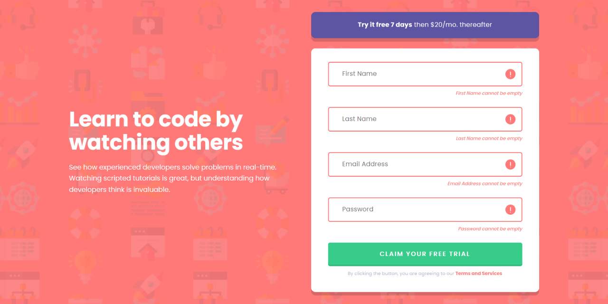
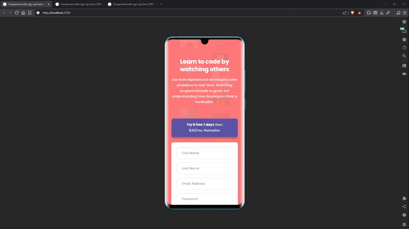

# 🚀 Intro Component with Sign-Up Form




A responsive sign-up form built as a solution to the Frontend Mentor challenge. The project focuses on semantic HTML, modern CSS architecture, accessibility, responsive design, and client-side form validation using native browser APIs.

This is a solution to the [Intro component with sign-up form challenge on Frontend Mentor](https://www.frontendmentor.io/challenges/intro-component-with-signup-form-5cf91bd49edda32581d28fd1).

---

## Links

- 🌎 [Live site](https://vimpdev.github.io/fem-js-newbie-02-intro-component-with-signup-form/)
- 📌 [Frontend Mentor solution](https://www.frontendmentor.io/solutions/intro-component-form-accessible-form-validation-with-vanilla-js-jUpzqNr1rK)

---

## 🎬 Demo



---

## 📸 Screenshots

### 📱 Mobile

|  |  |  |
| --- | --- | --- |

### 📲 Tablet

|  |  |  |
| --- | --- | --- |

### 🖥️ Desktop

|  |  |  |
| --- | --- | --- |

---

## ✨ Features

* Responsive layout for mobile, tablet, and desktop screens.
* Client-side form validation using the Constraint Validation API.
* Real-time validation feedback while typing.
* Dynamic error messages.
* Error icon display for invalid fields.
* Accessible validation feedback using `aria-live`.
* Accessible success dialog using the native `<dialog>` element.
* Keyboard-friendly navigation and focus states.
* Mobile-first development workflow.

---

## 🛠️ Built With

* HTML5
* CSS3
* JavaScript (ES6+)
* CSS Nesting
* CSS Cascade Layers (`@layer`)
* CSS Custom Properties
* Design Tokens
* Flexbox
* Grid Layout
* Constraint Validation API
* Dialog API

---

## 🧠 What I Learned

This project gave me hands-on experience building a complete form validation flow without relying on external libraries.

Key learnings included:

* Using the Constraint Validation API instead of manually validating every field.
* Structuring JavaScript into small, focused functions.
* Improving accessibility through dynamic ARIA attributes.
* Organizing CSS using Cascade Layers.
* Creating reusable design tokens with CSS custom * properties.
* Building responsive layouts using a mobile-first approach.
* Working with the native HTML Dialog API.

---

## 🎯 Key Technical Decisions

### CSS Architecture

The stylesheet is organized using CSS Cascade Layers:

```css
@layer reset, fonts, tokens, base, layout, components, utilities;
```

This separation keeps responsibilities clear and helps prevent style conflicts as projects grow.

### Design Tokens

Colors, spacing, typography, radii, shadows, and transitions were abstracted into reusable design tokens using CSS custom properties.

This improves consistency and maintainability across the project.

### Utility Patterns

A reusable `.stack` utility was implemented to handle vertical spacing throughout the layout.

```css
.stack {
  display: flex;
  flex-direction: column;
  gap: var(--stack-gap, 1rem);
}
```

This reduced repetition and allowed spacing to be controlled through custom properties.

### Validation Strategy

Instead of creating custom validation logic for each field, the project leverages the browser's built-in validation system:

* `checkValidity()`
* `validity.valueMissing`
* `validity.typeMismatch`

This approach keeps the implementation simple, reliable, and accessible.

### Accessibility

Special attention was given to accessibility by:

* Providing labels for all form controls.
* Using a `visually-hidden` utility for screen-reader-only labels.
* Associating errors through `aria-describedby`.
* Announcing validation messages using `aria-live`.
* Updating `aria-invalid` dynamically.
* Supporting keyboard-only navigation.
* Using the native `<dialog>` element for the success state.

---

## 📝 Validation Workflow

The validation logic was planned before implementation using a pseudocode-first approach.

1. Get the form element.
1. Get all form inputs.
1. Prevent the default form submission.
1. Validate every input.
1. Show an error state when validation fails.
1. Hide the error state when validation succeeds.
1. Generate context-specific error messages.
1. Update accessibility attributes.
1. Reset the form after successful submission.
1. Display a confirmation dialog.

### Final Validation Flow

```
Submit Form
    ↓
Prevent Default
    ↓
Validate Inputs
    ↓
 ┌───────────────┐
 │ Valid?        │
 └───────────────┘
      ↓
 Yes        No
 ↓           ↓
Hide Error   Show Error
 ↓           ↓
Reset Form   Keep Form Open
 ↓
Show Dialog
```

---

## 🤖 AI Collaboration

AI was used as a learning and review tool during development.

It was primarily helpful for:

* Discussing accessibility decisions.
* Reviewing semantic HTML structure.
* Exploring CSS architecture patterns.
* Evaluating naming conventions for design tokens.
* Breaking down JavaScript validation logic into smaller implementation steps.
* Reviewing responsive layout approaches.

All code was implemented, tested, and refined manually as part of the learning process.

---

## 👩‍💻 Author

- Frontend Mentor – [@vimpdev](https://www.frontendmentor.io/profile/vimpdev)

---